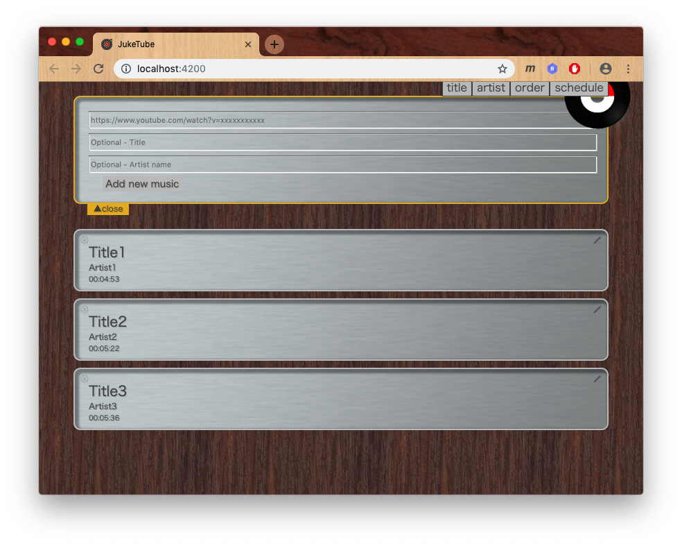
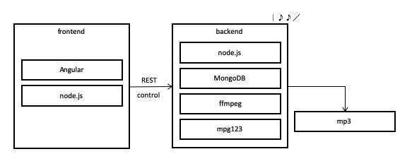

# JukeTube

JukeTube is a jukebox program using Youtube-dl.

## Screenshot

## Structure

Refer to the following figure for the structure of JukeTube.
JukeTube runs on various operating systems.

## How to use

Refer to "front/README.md" and "back/README.md".
